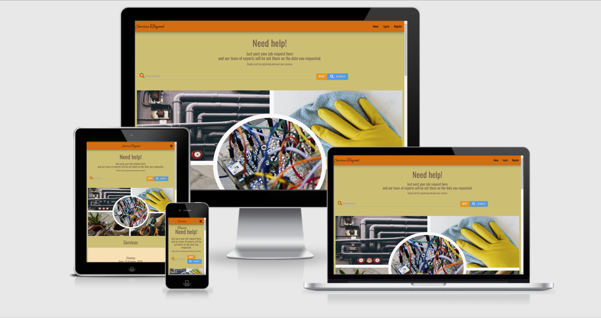
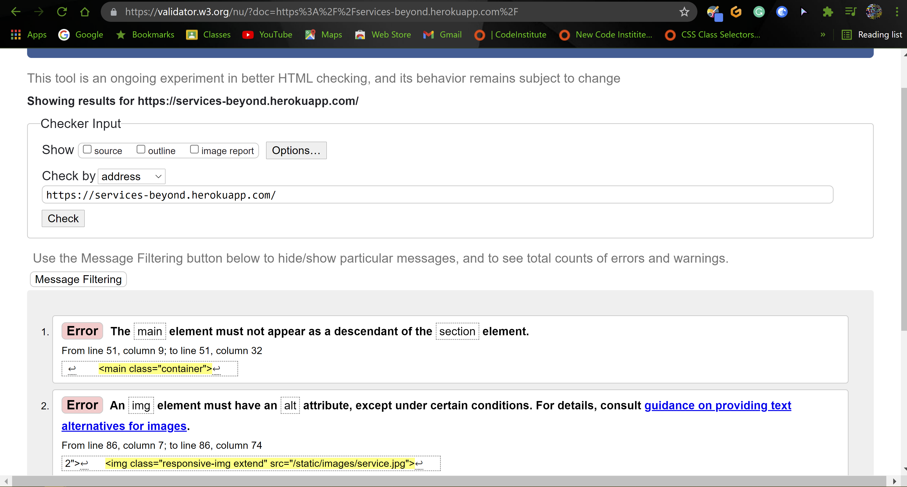
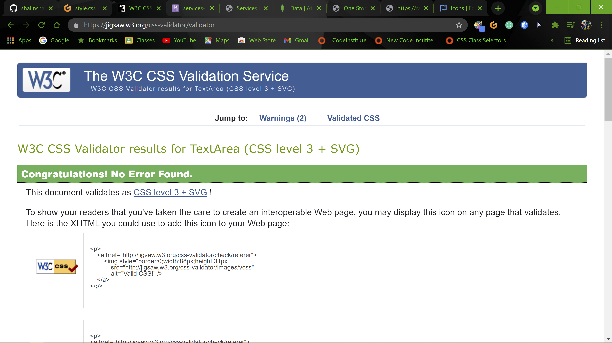
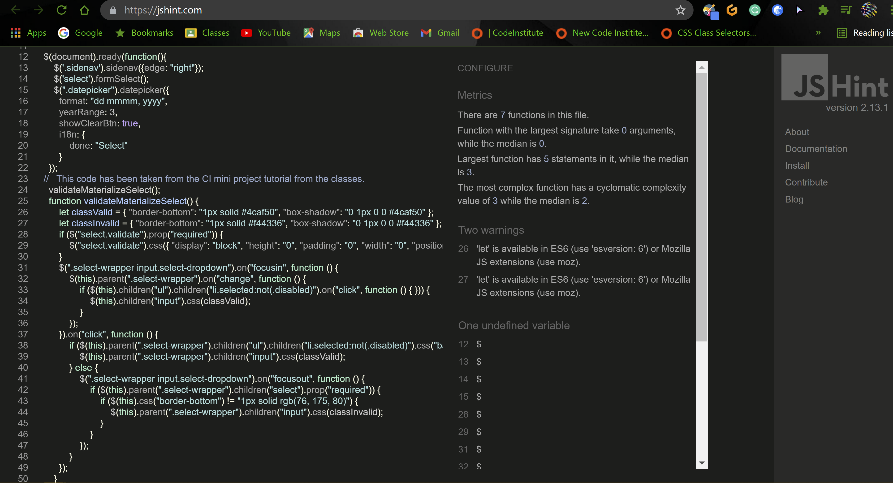
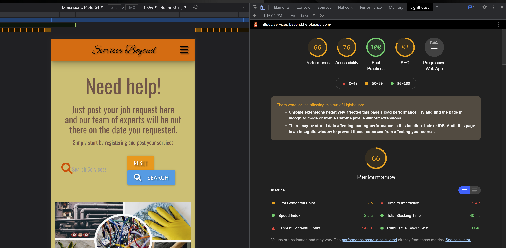
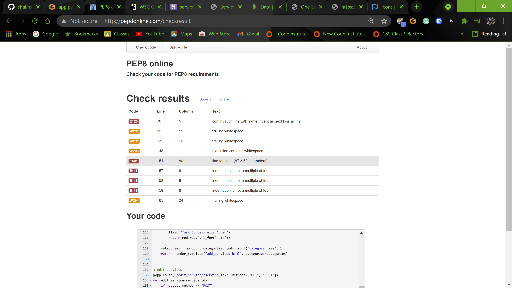

# Services-beyond

## Aim/ Purpose

The Services Beyond is a website dedicated as a platform for various people who want to search for a specific house related jobs by post there request and getting the service on the day they need. The website allows users to search through the categories of jobs available and add their own requested service to the page and recieve the need help they need.This website is my Milestone Project 3 for the Full Stack Developer course at Code Institute. You can access this site by clicking [Services Beyond](http://services-beyond.herokuapp.com/home)

## Table of Contents

- [User Experiencess](#user-experiences)
  - [User Stories](#user-stories)
  - [UX Framework](#ux-framework)
  - [Wireframes](#wireframes)
- [Existing Features](#existing-features)
- [Features to be added in future](#features-to-be-added-in-future)
- [Issues and Resolutions](#issues-and-resolutions)
- [Technoligies Used](#technologies-used)
  - [Languages used](#languages-used)
  - [Frameworks, Libraries, Programme and Resources Used](#frameworks-libraries-programme-and-resources-used)
- [Code Validation](#code-validation)
- [Testing](#testing)
- [Deployment](#deployment)
- [Credit](#credit)
- [Media](#media)
- [Acknowledgements](#acknowledgements)


## User Experiences

The goal of this website is to provide a satisfactory user experience and an accessible platform for users to find various available services which can be useful to support the necessities and day-to-day activities. The website should allow users to easily register or login and post the services they need and being a open platform the jobs can be picked up by the essential personals.The user after posting should recieve a call or an email by the certified personals for completing the jobs. The users are also able to easily add and edit their services as well as find the required services via this website.


### User Stories

#### First Time User Goals
- As a first time user, I would like to be able to register and create my own account on the website
- As a first time user, I would like to be able to post my required job for any specific services on the website.
- As a first time user, I would like to contacted based on the job they posted.
- As a first time user, I would like to be able to add, edit and remove my own services.

#### Frequent User Goals
- As a frequent user, I would like to be able to post for any specific services from the categories on the website.
- As a frequent user, I want to login to my existing account to add, edit and remove my services.
- As a frequent user, I want to be able to save my services for other users to search and view them without editing or deleting my added services.
- As a frequent user, I would like to be able to logout from my own profile.

#### Return User Goals
- As a return user, I want to easily navigate the site across all pages.
- As a return user, I want to easily search for any specific services on the website.
- As a return user, I would like to be able to access my existing profile to add, edit and remove my services.
- As a return user, I want to be able to save my services for other users to search and view them.


## UX Framework

### Strategy

The Services Beyond is an online platform to access various services with front-end and back-end functionality, created using HTML, JavaScript, CSS, Python, Flask, and MongoDB. The goal is to create a website that is user-friendly and allows users to easily search and get various available services.

### Scope

The website is interactive and allows users to input or add their own services for other users to view or display, allowing them to edit and delete their registered services and search for different services. The website has CRUD functionality.

#### Functional Requirements

Functional requirements include: a user-friendly navigation menu, a search bar, working templates for services to be added, database functionality that stores user login information and ability to create new accounts, with authentication. In addition, the website should be responsive for various screen sizes, maintaining the same level of functionality. The main functionality of the website is to allow users to create, read, update, and delete data, known as CRUD. The data created is stored in a database, and can be read through various pages on the website. The users also have the option to update and edit the data they have submitted, as well as delete it altogether. A search field allows users to search for specific services they are interested in.

#### Content Requirements

The content of the site should include a header and image, as well as a navigation menu. A search bar should allow users to search for services types. For the services there are specific categories from the users chooses from  and a short description of the service, adding your contact information through contact number and email address and the date on which you need the services to be rendered. An input field for users will allow them to select specific services. There is a profile page with the user's profile name card other then that is currently empty.

### Structures

The website is structured to allow new visitors to view specific services after you register and login. Once they open the landing page they can other users requests, which will give them idea create and view their profile page of existing services. Once logged in, users are able to click on the main header, which allows them to search for different services, as well as add and edit their own services. In addition, the users are able to save the registered services. Once the user wishes to end their session, they can click the 'Log Out' option in the menu to return to the home page.

### Skeleton

The skeleton of the website will utilise Materialize for the CSS layout of the pages. A navigation menu will allow users to go to their chosen pages. The main landing page will function to allow users to select numerous service types they are interested in, and provide links to add or edit their own services. This minimises the need for different pages for users to visit and provides a seamless experience. When adding or editing a service, additional options in the navigation menu allow the user to navigate back to their own profile, or to end the session and log out. This simplifies the number of options for the user and keeps the website easy to use.

### Surface

The surface design of the website will also utilise Materialize CSS to provide a theme and styling for the components of the website.
The first step for my research was visiting sites and knowing different layouts, elements in navigation bar, images, quotes, text, and colors.

### _Colors_ :

- Black
- Shade of Yellow
- Orange
- Brown

### _Typography_ :

- Ephesis
- Oswald

 Google Fonts is used to style the text using the 'Ephesis' font used in the Logo and the 'Oswald' for all the other text and FontAwesome is used for various icons for the buttons and the forms. The color scheme is designed to be fall colors appealing to the target audience of varied professionals, and provide clear readability as well as being responsive.

## Wireframes

- As an initial process of the project design, wireframes were created for desktop and mobile screen sizes using [Figma Wireframe](https://www.figma.com/file/WbKaj1kTqyEGyiKLDmUvlh/service-beyond).

## Existing Features
- All the pages on this website are mainly didvided into 4 section which are:
  - Navbar
  - Flash Message
  - Main content
  - Footer

#### Navbar
- Navbar for this website is created by utilizing Materalize CSS framework along with script to activate the side nav, Navbar is on top of the page expanding full screen size with menu items on the right and company name as Navbar brand on left side of the page. Navbar has three main links to welcome the users which are Home, Login and Register and user will be redirecting to the correct page once link is clicked. Additionally nav-links will be updated accordingly once user logged into the page and users will be able to see updated nav-links as below
  - Profile
    - user able to view their profile by selecting Profile page option on the Navbar
  - Add Services
    - user able to add new job services to the page by selecting Add Services option on the Navbar
    After entering the services the user is able to see the posted service on the home/landing page along with other users posted services. Only the login user is able to edit and delete his services, if needed any changes.
  - Logout
    - user able to logout from the page and return to the login page.
  - View/Delete
    - This option is restricted to admin user only, option to gain access to this page is only visible once user logged in as an admin user

#### Flash message
- All the flash message will display just below the Navbar on every pages, python user flash library to generate the flash message and render to the page whenever required. This will display if the user is logged in or logged out, if has an invalid username or passwaord, if the services is successfully edited and updated. 

#### Main content
- This is the Main section of the page where services posted are displayed for all the users, the description can be viewed by clicking on the activator on the right side of the card. There is a image to attract the users with all the services provided.

#### Footer
- Small footer is created to hold the copyright information of the website which is final section of the page and sit at the bottom and each page of the website contain same footer with same copyright information

#### Home Page
- The home page contains a logo which is link back to the home page from any pages being used. There are nav links on the right side which only contains three links prior to logging in. Once logged in the session users will see the profile, add services and logout links along with the home link still there. The page also contains the search which will search for the category name and the description for all the services being added. There is an image for show all the services being provided by the company. On the lower part there is services field which shows all the services being posted. The page also contains a basic footer which shows the copyrights.

#### Search field
- By inputing the text on the search line and clicking on the search, if the search text is there in the database the search will show a result under the services field. There is a reset button next to the search which will redirect you back the home page by reseting the field.

#### Services field
- In this field the posted services will be visible to all the users. There is a card which appears the category name, created by and the date the job needs to be performed. On clicking on the activator on the right side which will activate the next card by sliding upwards and the full description for the post job will be shown. There is a close button to close the card and if the text or description is too long then a scroll down is there to view properly. Bottom if the slide card there is an edit and delete buttons only functioning when the users is in session and can only deleted or upgraded by created users. 

#### Registration
- On the registration page there is a simple form which has two required fields. First is the username and the second is the password 
Both are required fields and by clicking on the button it is validated and message appears on the top. If the user successfully logs in then the information is stored in the database. Additionally this page utilize Werkzeuz security which is python library to hash the password and stored in database securley. Underneath the registration form small text with login option also provided which allow user to login directly if they are already registered however select register option by mistake. This allow user to peform registration and login task from the same page without having to navigate to the exact page.


#### Login page
- - This page looks very identical to register page and contains similar options however only accessible to those user who is already registered to the page, user simply need to input their username and password to login to the page, once login successful flash message will display on screen to welcome the user and user will be redirected to their own profile. This page utilize some python functionality to check and verify the users input and only allow user to login if their details matched with what they have provided while registration. Additionally python will display the flash message to inform user if username or password they supplied is not found and redirect the user back to login page again. Underneath the login form small text with registration option also provided which allow user to register directly if they are not registered however select login option by mistake. This allow user to peform registration and login task from the same page without having to navigate to the exact page.

### Add Services page
- This option is visible to the user only once they are logged into the page, this page allow user to add their own job by completing the form provided and then hit submit button. input elements in the forms need to fullfll certain criteria and if supplied input do not match certain criteria or left empty then warning message will appear below input field and colour of the bottom border will change to red, also required attribute is utilize on this form to ensure user are not able to submit the form without completing, if any of the field left empty and hit submit button then required attribute trigger and let user knows that they must complete the field. Python funtionality also added to this page to conduct some check to ensure that only user are able to add the job. once user select the option to add new job then python function will excute and do some checks and only let user to add the job if user in the session and user who logged in are the same person, otherwise python will immediatley redirect user to login page and display flash message accordingly. Javascript in the form of jQuery is utilized to validate the form and display and hide error message accordingly while user completing the form. Once user added the information, python will then send the information to mongoDB using insertOne method and also render the information in the home page

### Profile page
- This option also only visible to the user once they are logged in. Python function will execute once user select this option and check to verify the user first and if person selecting the option is really a user then python will allow user to access the page and display welcome message to the user, if user is not verified then python will redirect user to the login page and display flash message accordingly. Once user verified and inside the page user able to see all the job added to the page by themself and also able to edit and delete if they wish to do by just clicking the buttons brovided below job images.

  #### Edit/delete job
  - User can edit or delete their own job once they are inside their own account, every job added by user will be shown in My account page with job images and job title, each job has two options for user which are edit and delete. Once user select edit job option then python function will trigger to check wether person trying to edit the job is really a user or not, if not then user will be redirected to login page aagin with correct flash messaeg and if the person is really the user then python will populate the form with pre-field data in the input field and allow user to update their job information. Similar to add new job form, edit job form also need to pass the input validation check which is done by utilizing Javascript in the form of jQuery. once inpt field validate and user select the update button then all the updated information will be store in the database which is done by using updateOne method.
  Additionally user can also delete their own job, once user select delete button python will trigger the delete function and run if/else statement to check user's details and let user to act accordingly. First python will check if user is in the session or not then second step python will check if user logged in is the similar user who add this job. if both condition is satisfied they only user will be able to delete the job otherwise python will redirect the user to login page and display flash message accordingly
  python use mongoDB remove() method to perform delete job once condition satisfied. Once user select the delete button, modal will trigger and display warning message on screen to allow user to confirm their delete request or cancel, purpose of this modal is to prevent deleting the job straightway if user select the delete button by mistake or in case user wants to change their mind once after delete button clicked. 

### Logout
- This option only visible to the user once they are logged into the page, user can simply select the logout option and they will be loggout from the page, python function will execute once user select logout option and redirect them to login page immediately and display flash message accordingly.

## Features to be added in future
- I would like to add more defensive safety for the users. Using more security for the password and maybe two step verification.
- I would like the profile page to display more features then just the users name.I would like the user to see the posted services on his profile and can edit and delete from that page.
- I would like to add a conformation on the delete the service. SO a modal with conformation can check twice if the user wants to delete the service. 
- I would like after search the result should appear right there or should be able to redirect to the page this task is happening.

## Issues and Debugging
- When starting the gitpot after completely closing it down the env.py file is  not present in the local file. So the error would show the flask needs to installed. Then after installing the flask i have to generate the env.py file again by adding all the cconfiguration like `("IP", "0.0.0.0")`, `("PORT", "5000")`,
`("SECURITY_KEY", "")`, `("MONGO_URI", mongodb+srv://task:<password>@myfirstclustera.fwmaz.mongodb.net/<name-DB>?retryWrites=true&w=majority)`, `("MONGO_DBNAME", "")`.  After adding all this I still got the error of install PyMongo and flask_pymongo. Then I used pip intall flask_pymongo and pip install dnspython. After doing all this the app was restarted and it will run. After debugging it [app file](static/images/debugged-env.jpg).
- With python while adding the search app I only added the "GET" method and the search would not function the way it needs to. Then I went back to the tutorial videos and then found out that search has a ["GET", "POST"] methods.
- Working with PyMongo I was getting an error where I was not able to connect my mongoDB to the site. Then after going through I found out that the password I was entering in MONGO_URI was incorrect. After changing the password it was connected.
- Working with jinja templates I was getting alot of spell check errors because I have placed var name as services and service. After figuring out the spelling mistakes I was able to work the browser properly.
- Browser threw werkzeug.routing.BuildError while I was initially testing my registration page, this took me a while to figure out as I couldn't spot any issue in my codes and neither any speeling error, however I have somehow spoted that there was on app.py file as I as missing @ symbol on my routing and this was causing an error which solved after I corrected this.

## Technologies Used

### Languages Used
- [Python](https://www.python.org/)
    - I have used  **Python** as the back-end programming language for my project.
- [HTML](https://en.wikipedia.org/wiki/HTML)
    - I have used **HTML** as the main structural element of my project.
- [CSS](https://en.wikipedia.org/wiki/Cascading_Style_Sheets)
    - The project uses **CSS** to style and theme pages..
 - [Javascript](https://en.wikipedia.org/wiki/JavaScript)
    - The project uses **Javascript** to allow for DOM manipulation.

### Frameworks, Libraries, Programme and Resources Used  
- [JQuery](https://jquery.com)
  - The project uses **jQuery** as the primary JavaScript functionality. This is both the standard jQuery that is built with Materialize components, and my custom jQuery used in my script.js file.        
- [Flask](http://flask.palletsprojects.com/en/1.1.x/)
  - The project uses **Flask**, which is a Python microframework. **Flask** help to dynamically generate pages, generate dynamic links, and content within the application.
- [PyMongo](https://api.mongodb.com/python/current/)
    - The project uses **PyMongo** as the Python API for MongoDB. This API enables linking the data from the back-end database to the front-end app.
- [Materialize](https://materializecss.com/)
    - The project uses the **Materialize** framework to simplify the structure of the website and make the website responsive easily.
- [MongoDB](https://www.mongodb.com/)
    - The project uses *** MongoDB *** to store the database in the cloud. The information displayed in the front-end is pulled from the database store.
- [Jinja](https://jinja.palletsprojects.com/en/2.10.x/)
  - Jinja templating language was used with flask in the HTML code. Jinja was used simplify my HTML code, avoid repetition, and allow simpler linking of the back-end to the front-end.
- [Google Fonts:](https://fonts.google.com/)
    - Google font was used to embed the YuseiMagic and Ovo types font which are used on all pages throughout the website.
- [Font Awesome:](https://fontawesome.com/)
    - Font Awesome was used to add icons for aesthetic and UX purposes.
- [Figma](https://figma.com/)
    - Balsamiq was used to create the wireframes during the design process.
- [Gitpod](https://www.gitpod.io/)
    - Gitpod was used as IDE for local development.
- [GitHub](https://github.com/)
    - GitHub was used to store the projects code after being pushed from Gitpod.
- [Git](https://git-scm.com/)
  - Git was used as aversion control system to regularly and add commit changes made to project and pushing them to GitHub
- [Heroku](https://id.heroku.com/login)
  - Heroku was used as the hosting platform to deploy my project.
- [HTML Formatter](https://htmlformatter.com/) 
    - HTML formatter was used to format HTML code
- [W3.CSS](https://www.w3schools.com/w3css/defaulT.asp) 
    - General resources.
- [Stack Overflow](https://pt.stackoverflow.com/)
    - General resources.
- [Youtube](https://www.youtube.com/) 
   - General resources.
- Code Institute SLACK Community
   -General resources


## Code Validation

- [W3C Markup Validation](https://validator.w3.org/#validate_by_input) 
  - 
  - W3C Markup Validation was used throughout the process to validate HTML codes
- [W3C CSS Validation](https://jigsaw.w3.org/css-validator/) 
  - 
  - W3C CSS Validation was used to vaildate CSS codes
- [JSHINT](https://jshint.com/) 
  - 
  - JSHINT was used for JavaScript code warning & error check.
- [Lighthouse](https://developers.google.com/web/tools/lighthouse) 
  -  
- [PEP8 online](http://pep8online.com/)
  - 
  - PEP8 online tool was used to ensure all python codes on projects are PEP8 compliant.
- [Python Tutor](https://pythontutor.com/visualize.html#mode=edit)
  - Python tutor was used to visualize the python code and identify any error.

## Testing 
- Testing has an extented file attached [CLICK HERE TO VIEW](TEST.md)


## Deployment

I used GitHub for my version control and Heroku to host the live version of my project. To deploy my website to Heroku, use following steps:

1. Create the app in Heroku.
2. Run the `npm install -g heroku` command in the terminal window to install heroku in the workspace.
3. Run the `heroku login -i` command in the terminal window and enter credentials to login to Heroku.
4. Add and committ the files to Git using the `git add .` and `git commit -m ""` commands in the terminal window.
5. Create a requirements.txt file using the following command in the terminal window:

    ```pip3 freeze --local > requirements.txt```

7. Created a Procfile using the following command in the terminal window:

  ```echo web: python <fileName.py> > Procfile```

8. Run the `git push -u heroku main` command in the terminal window to push the app to Heroku.
9. Login to the Heroku page and Entered the following Config Var in Heroku:
   - IP : `0.0.0.0`
   - PORT : `5000`
   - MONGO_URI :`mongodb+srv://<username>:<password></password>@<cluster_name>.9kpcw.mongodb.net/<database></database>?retryWrites=true&w=majority` 
   - SECRET_KEY : `<your_secret_key>`
   - MONGO_DBNAME : `<database name>`
10. Select Deploy option on Heroku and choose Github as Deployment method then connect to Github and search for repositery to connect by providing the repo name on search box.
11. Heroku will then detect the repo on Github then, click connect
12. Choose main branch as branch to deploy and click Enable automatic Deploys
13. your project has now deployed to Heroku
14. In the top right of the heroku dashboard press the "Open App" button to view your deployed Heroku app.


## Credits
- I would like to give credits to [Dev Ed](https://www.youtube.com/c/DevEd) with forms, validation and the scripts.
- I would like to give credits to [Kevin Powell](https://www.youtube.com/kepowob) for guiding me through better CSS styling.

## Media
- All the images are from [unsplash](https://unsplash.com/)

## Acknowledgements
- I would like to thank my mentor Sandeep Agarval for his guidance and advice on this project before submission.
- Thanks to everyone on Slack Community for always being on-hand with requests and support.
- Thanks to everyone on CI tutor support team for always providing with the support and guidance.
- I would like to thank shiv 123-coder from Code institute for inspiring me and giving me ideas for this site.
- Thanks to everyone from Student Care team (CI) for keeping me update with all changes such as tutor support availibility holiday period and most importantly checking regularly on my progress and always ready to support on my study.